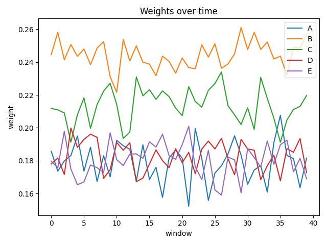

# Examples

This project includes realistic examples that simulate production usage.

---

## End-to-end example

A single decision window where observations are evaluated and new weights
are proposed.

See:
- `examples/end_to_end.py`

This demonstrates:
- strategy evaluation
- guardrail enforcement
- explanation generation

---

## Multi-window simulation

A longer-running simulation that shows learning over time.

See:
- `examples/multi_window.py`

This example:
- simulates repeated observation windows
- demonstrates when the system holds vs moves
- outputs CSV data for analysis or visualization

---

## Visualization

The following chart shows how variant weights evolve across windows in the
multi-window simulation.

--- 

## Interpreting results

It is normal to observe:
- long periods of no movement when data is insufficient
- gradual weight shifts rather than sharp jumps
- minimum exposure floors being enforced

These behaviors are **intentional**.
